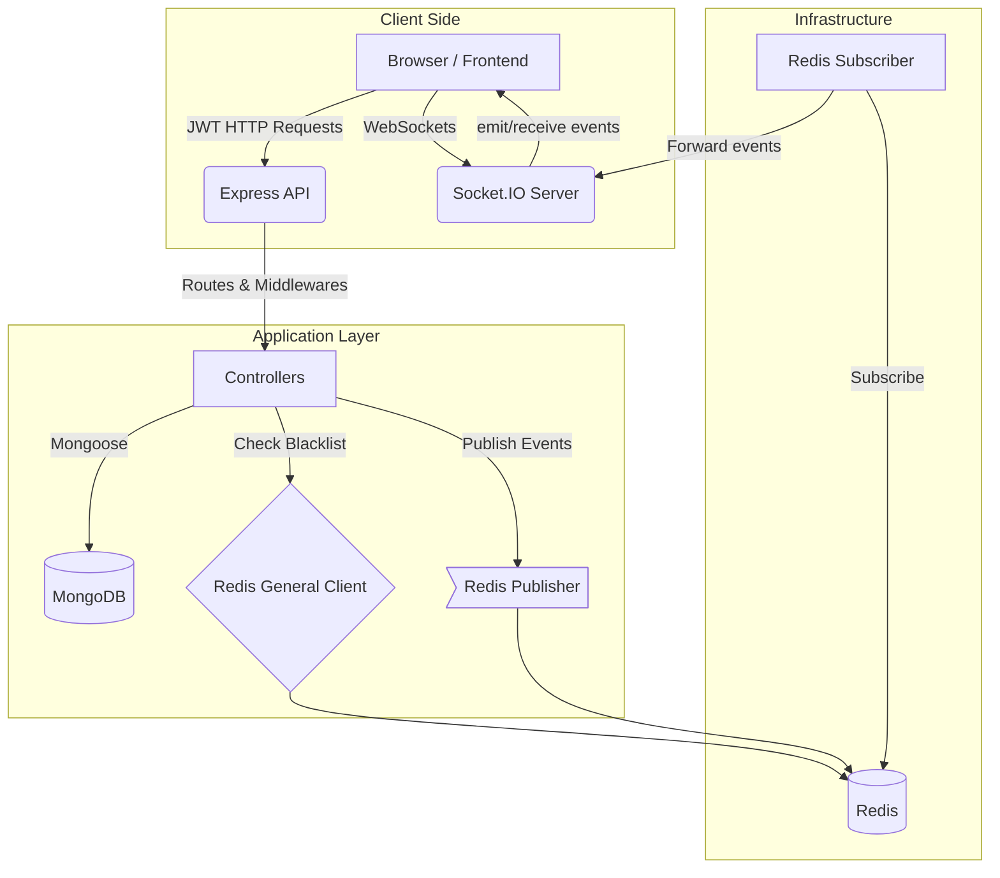

# Arquitectura del Backend Task Manager

```mermaid
graph TD
    subgraph Client Side
        A[Browser / Frontend]
        A -- JWT HTTP Requests --> B(Express API)
        A -- WebSockets --> C(Socket.IO Server)
    end

    subgraph Application Layer
        B -->|Routes & Middlewares| D[Controllers]
        D -->|Mongoose| E[(MongoDB)]
        D -->|Publish Events| F>Redis Publisher]
        D -->|Check Blacklist| G{Redis General Client}
        C -->|emit/receive events| A
    end

    subgraph Infrastructure
        G --> H[(Redis)]
        F --> H
        I[Redis Subscriber] -- Subscribe --> H
        I -- Forward events --> C
    end

    classDef ext fill:#f9f,stroke:#333,stroke-width:2px;
``` 