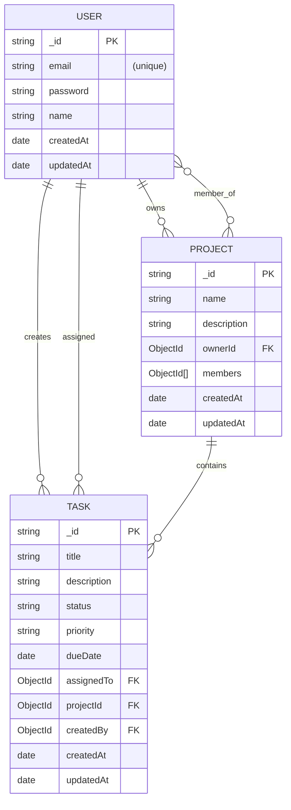

# Database Entity-Relationship Diagram

> MongoDB con Mongoose – las referencias se muestran como FK solo para fines de visualización.

```mermaid
erDiagram
    USER {
        string _id PK
        string email "(unique)"
        string password
        string name
        date createdAt
        date updatedAt
    }

    PROJECT {
        string _id PK
        string name
        string description
        ObjectId ownerId FK
        ObjectId[] members
        date createdAt
        date updatedAt
    }

    TASK {
        string _id PK
        string title
        string description
        string status
        string priority
        date dueDate
        ObjectId assignedTo FK
        ObjectId projectId FK
        ObjectId createdBy FK
        date createdAt
        date updatedAt
    }

    USER ||--o{ PROJECT : owns
    USER }o--o{ PROJECT : member_of
    USER ||--o{ TASK : creates
    USER ||--o{ TASK : assigned
    PROJECT ||--o{ TASK : contains
``` 