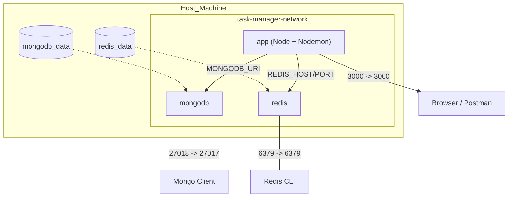

# Docker Containers – Development Setup

```mermaid
graph TD
    subgraph Host_Machine
        direction TB
        subgraph task-manager-network
            APP["app (Node + Nodemon)"]
            MONGO["mongodb"]
            REDIS["redis"]
        end
        VOL1[(mongodb_data)] -.-> MONGO
        VOL2[(redis_data)] -.-> REDIS
    end

    %% Port mappings
    APP -- "3000 -> 3000" --> USER["Browser / Postman"]
    MONGO -- "27018 -> 27017" --- HOSTMONGO["Mongo Client"]
    REDIS -- "6379 -> 6379" --- HOSTREDIS["Redis CLI"]

    %% Internal comms
    APP -- "MONGODB_URI" --> MONGO
    APP -- "REDIS_HOST/PORT" --> REDIS
``` 